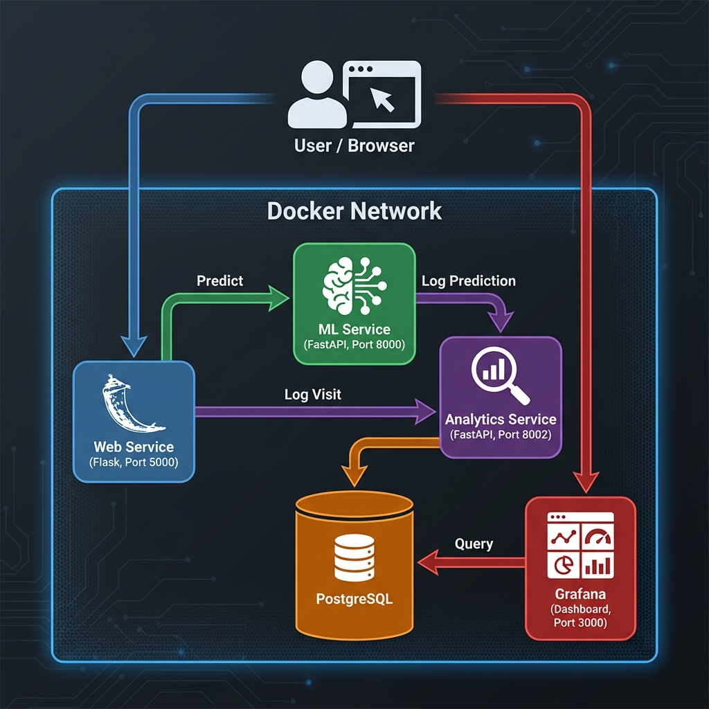

# Deploying ML Applications with Docker: Pomegranate Disease Detection

This project demonstrates how to build, containerize, and deploy a robust Machine Learning application using **Docker** and **Docker Compose**. It features a microservices architecture that separates concerns between the web frontend, the ML inference engine, and the analytics backend.

## Project Overview

The core application is a **Pomegranate Disease Detection System** that uses Deep Learning to identify diseases in pomegranate leaves. However, the primary focus of this repository is to showcase **docker based ML deployment**, including:

-   **Microservices Architecture**: Decoupling services for scalability and maintainability.
-   **Containerization**: Using Dockerfiles to create reproducible environments for Python (Flask/FastAPI) and Postgres.
-   **Orchestration**: Using `docker-compose` to manage multi-container applications, networking, and volumes.
-   **Service Discovery**: configuring inter-service communication using Docker network aliases.
-   **Monitoring**: integrating Grafana for real-time analytics visualization.

## Architecture

The system follows a microservices architecture layout.



The system is composed of the following containerized services:

1.  **[Web Frontend](web/README.md)**:
    -   **Tech**: Flask, Jinja2, Bootstrap.
    -   **Role**: User interface for image uploads. It acts as the gateway, forwarding requests to the ML service and logging interactions to the Analytics service.
    -   **Docker**: Uses a Python 3.9 image.

2.  **[ML Inference Engine](ml/README.md)**:
    -   **Tech**: FastAPI, TensorFlow/Keras, SQLite (caching).
    -   **Role**: Loads the heavy DL model and provides a REST API for inference. It isolates the heavy compute and dependencies (TensorFlow) from the lightweight frontend.
    -   **Docker**: optimized image with system dependencies for image processing (`libgl1`).

3.  **[Analytics & Logging](analytics/README.md)**:
    -   **Tech**: FastAPI, SQLAlchemy, PostgreSQL.
    -   **Role**: Centralized logging service. Stores prediction results and visit stats, allowing the ML and Web services to remain stateless regarding analytics.

4.  **Database (`postgres`)**:
    -   **Role**: Persistent storage for the Analytics service.
    -   **Docker**: Official `postgres:15` image with named volumes for data persistence.

5.  **Visualization (`grafana`)**:
    -   **Role**: operational dashboards to monitor disease trends, upload stats, and system usage.
    -   **Docker**: Official `grafana/grafana` image with pre-provisioned dashboards and datasources.

## Getting Started

### Prerequisites
-   [Docker Desktop](https://www.docker.com/products/docker-desktop/) installed and running.

### Deployment

1.  **Clone the repository**:
    ```bash
    git clone <repository-url>
    cd <repository-name>
    ```

3.  **Setup the Model**:
    > **Note**: The actual deep learning model (`model.h5`) is **not included** in this repository to keep it lightweight.
    -   Place your trained model file (e.g., `model.h5`) in the `ml/Model/` directory.
    -   Ensure the filename matches `MODEL_PATH` in `ml/main.py` (default: `model.h5`).

4.  **Build and Run**:
    Use Docker Compose to build the images and start the entire stack with a single command:
    ```bash
    docker-compose up -d --build
    ```
    *   `-d`: Runs containers in the background (detached mode).
    *   `--build`: Forces a rebuild of images to ensure code changes are applied.

3.  **Access the Services**:
    -   **Web App**: [http://localhost:5000](http://localhost:5000)
    -   **Grafana Dashboards**: [http://localhost:3000](http://localhost:3000)
        -   Default Credentials: `admin` / `admin`

4.  **Stop the Application**:
    ```bash
    docker-compose down
    ```
    To stop and remove persistent configurations (reset database):
    ```bash
    docker-compose down -v
    ```

5.  **Admin Maintenance (Reset Data)**:
    Only for administrators. To wipe all project data (ML cache, analytics log, and uploads) while the system is running:
    
    Powershell:
    ```powershell
    curl -Method POST -Uri http://localhost:5000/admin/reset-project -Headers @{ "X-Admin-Secret" = "supersecretadmin" }
    ```
    
    Bash:
    ```bash
    curl -X POST http://localhost:5000/admin/reset-project -H "X-Admin-Secret: supersecretadmin"
    ```
    *(Note: The secret key `supersecretadmin` is defined in `docker-compose.yml`)*


## Development Workflow

The directory structure acts as a monorepo for the microservices:

```
├── web/            # Flask Web Service
├── ml/             # FastAPI ML Service
├── analytics/      # FastAPI Analytics Service
├── grafana/        # Dashboard Configuration
└── docker-compose.yml
```

To work on a specific service (e.g., `web`), you can rebuild just that container:
```bash
docker-compose up -d --build web
```

## API Endpoints

### ML Service (Internal Port: 8000)
-   `POST /predict`: Input: `file` (image). Output: JSON with class probabilities.

### Analytics Service (Internal Port: 8002)
-   `POST /log-prediction`: Input: JSON prediction data. Output: Log ID.
